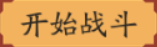

DarkUnion 拥抱恶魔的力量吧
=========================
实现自动组队/单刷痒痒鼠的副本。任意分辨率下，重新制作模板即可使用。

理论上支持Linux、MacOS、windows。但是痒痒鼠桌面版只支持Windows。

环境依赖
========
| Name | Version | 
| ---- | ------- |
|[PyAutoGUI](https://github.com/asweigart/pyautogui)|v0.9.42|
|[PyGetWindow](https://github.com/asweigart/PyGetWindow)|v0.0.1|
**注意：pygetwindow的后续版本无法在Windows环境下安装。推荐使用v0.0.1版本**

使用方法
=======
1.登入游戏，缩放到合适的分辨率

2.分三次，在组队界面，副本界面，和战斗结束界面下点击制作模板按钮。

将根目录下的符合下面三张图片的临时文件重命名后覆盖到source文件夹。

　battle_ready_1.png

  battle_ready_2.png

 battle_finished.png

注意：因为游戏界面缩放后重采样的结果不同，即使再次缩放到同一分辨率也不能保证上次制作的模板有效。具体请查看程序运行过程中打印的比较值。

3.选择组队或者单刷点击开始，即可自动战斗。

程序默认将游戏窗口移动到右侧中间的位置，但是移动窗口不会影响到程序运行。

如果不需要此功能，请将Akuma.py文件Line140注释：

`self.game_window.moveTo(SCREEN_WIDTH - self.window_width - 20, int(SCREEN_HEIGHT/2 - self.window_height/2))`

